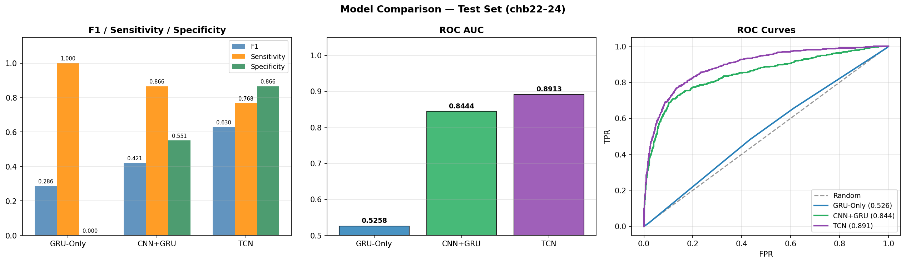
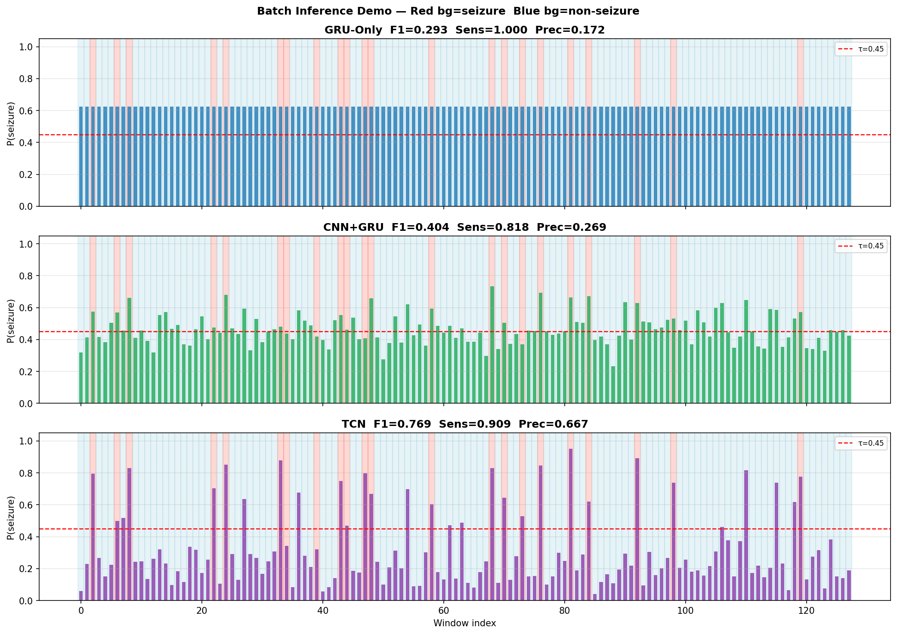

# NeuroScribe: EEG Seizure Detection with Evidence-Grounded Clinical Reporting

**Author:** Charita Madhamsetty
**Course:** IDAI 780
**Institution:** Rochester Institute of Technology

---

## Project Overview

NeuroScribe is an end-to-end pipeline for automated EEG seizure detection using deep learning, combined with evidence-grounded clinical report generation using a Large Language Model (LLM). The system detects seizure events from raw EEG signals and generates clinical narratives that are verified against model predictions to reduce hallucinations.

### Framework

```
Raw EEG (EDF)
     │
     ▼
Preprocessing (bandpass + notch filter, 4s windowing, 50% overlap)
     │
     ▼
Deep Learning Models
 ┌───────────┬───────────┬───────────┐
 │ GRU-Only  │  CNN+GRU  │    TCN    │  ← Compared
 └───────────┴───────────┴───────────┘
     │
     ▼
Seizure Probability per Window
     │
     ▼
LLM Clinical Report Generator  →  Claim Verifier (Evidence Grounding)
     │
     ▼
Evidence-Grounded Clinical Report
```

---

## Directory Structure

```
NeuroScribe-EEG-Seizure-Detection-with-Evidence-Grounded-Clinical-Reporting/
│
├── config.yaml                          # All hyperparameters and data paths
├── requirements.txt                     # Python dependencies
│
├── data/
│   └── chb-mit/                         # CHB-MIT EEG dataset (download separately)
│       ├── chb01/
│       ├── chb03/
│       └── ...                          # Patient EDF files + summary .txt
│
│
├── notebooks/
│   ├── 01_eda_preprocessing.ipynb       # Exploratory data analysis & signal visualisation
│   ├── 02_baselines_training.ipynb      # Train GRU-Only, CNN+GRU baselines
│   ├── 03_tcn_training.ipynb            # Train TCN (main model)
│   ├── 04_testing_comparison.ipynb      # Evaluate all models on test set
│   └── 05_hallucination_demo.ipynb      # LLM hallucination demonstration
│
├── src/
│   ├── data/
│   │   ├── dataset.py                   # EEGDataset, build_split_dataset
│   │   ├── loader.py                    # build_train_loader, build_eval_loader
│   │   └── preprocessor.py              # Bandpass/notch filtering, windowing
│   │
│   ├── models/
│   │   ├── gru_only.py                  # Baseline: Bidirectional GRU + attention
│   │   ├── cnn_gru.py                   # Baseline: CNN + GRU hybrid
│   │   ├── tcn.py                       # Main model: Temporal Convolutional Network
│   │   └── losses.py                    # Focal loss (handles class imbalance)
│   │
│   ├── eval/
│   │   └── trainer.py                   # run_epoch(), training & evaluation loop
│   │
│   ├── utils/
│   │   ├── extractor.py                 # EEG feature extraction (amplitude, frequency, spatial)
│   │   └── shared_loaders.py            # Cached DataLoader builder (get_loaders)
│   │
│   └── llm/
│       ├── report_generator.py          # LLM-based clinical report generation
│       └── claim_verifier.py            # Evidence grounding / hallucination check
│
├── checkpoints/                         # Saved model weights (auto-created)
│   ├── GRU_Only_best.pt
│   ├── CNN_GRU_best.pt
│   └── TCN_best.pt
│
└── Report_Figures/                      # Output visualisations
    ├── class_distribution.png
    ├── seizure_waveform.png
    ├── seizure_duration.png
    ├── tcn_training_curves.png
    ├── baseline_training_curves.png
    ├── comparison_results.png           # F1/Sensitivity/Specificity + ROC AUC + ROC curves
    └── demo_batch_predictions.png       # Per-window seizure probability visualisation
```

---

## Environment & Dependency Installation

### Requirements
- Python 3.10+
- CUDA-capable GPU recommended (CPU training is supported but slow)

### Option 1 — pip (recommended)

```bash
pip install -r requirements.txt
```

### Option 2 — conda

```bash
conda create -n neuroscribe python=3.11
conda activate neuroscribe
pip install -r requirements.txt
```

### Key dependencies

| Package | Version | Purpose |
|---------|---------|---------|
| torch | >=2.1.0 | Deep learning |
| mne | >=1.6.0 | EEG/EDF file loading |
| numpy | >=1.24.0 | Numerical operations |
| scikit-learn | >=1.3.0 | Metrics |
| openai | >=1.0.0 | LLM report generation |
| jupyterlab | >=4.0.0 | Notebook interface |

---

## Data Preparation

### 1. Download the CHB-MIT Dataset

The CHB-MIT Scalp EEG Database is publicly available on PhysioNet:

```
https://physionet.org/content/chbmit/1.0.0/
```

Download patients: **chb01, chb02, chb03, chb04, chb05, chb06, chb07, chb08, chb09, chb10, chb11, chb12, chb13, chb14, chb15, chb16, chb17, chb18** (train), **chb19, chb20, chb21** (val), **chb22, chb23, chb24** (test).

Place them under:
```
data/chb-mit/
├── chb01/
│   ├── chb01-summary.txt
│   ├── chb01_01.edf
│   └── ...
├── chb02/
└── ...
```

### 2. Update Paths in config.yaml

Edit `config.yaml` to point to your local data directories:

```yaml
data:
  raw_dir: "/path/to/your/data/chb-mit"
  processed_dir: "/path/to/your/data/processed"
```

### 3. Data Caching (Automatic)

No manual preprocessing step is needed. Each notebook automatically:
1. Checks `/tmp/neuroscribe_cache/` for a cached `.npz` file
2. If not found, builds from raw EDF (takes ~10–15 min on first run per session)
3. Saves to `/tmp` for fast reloading within the same session

**Note:** `/tmp` is cleared on logout. On next login, the first notebook run will rebuild the cache automatically.

---

## Training & Testing Demo

Run notebooks in order:

### Step 1 — Exploratory Data Analysis

```bash
jupyter lab notebooks/01_eda_preprocessing.ipynb
```

Visualises raw EEG signals, seizure annotations, class distributions, and preprocessing pipeline.

### Step 2 — Train Baselines

```bash
jupyter lab notebooks/02_baselines_training.ipynb
```

Trains GRU-Only and CNN+GRU baselines. Saves checkpoints to `checkpoints/`. Training takes ~5–10 minutes per model on GPU.

### Step 3 — Train TCN (Main Model)

```bash
jupyter lab notebooks/03_tcn_training.ipynb
```

Trains the Temporal Convolutional Network with:
- Data augmentation (Gaussian noise, amplitude scaling, channel dropout)
- Cosine annealing LR schedule
- Per-epoch threshold sweep on validation set

Training takes ~60–90 minutes on GPU (up to 50 epochs, patience=10).

### Step 4 — Evaluate All Models

```bash
jupyter lab notebooks/04_testing_comparison.ipynb
```

Loads all three checkpoints and evaluates on the held-out test set (chb22–24). Produces comparison table, ROC curves, and per-model visualisations.

### Step 5 — LLM Hallucination Demo

```bash
jupyter lab notebooks/05_hallucination_demo.ipynb
```

Demonstrates evidence-grounded clinical reporting and hallucination detection. Requires an OpenAI API key set as `OPENAI_API_KEY` environment variable.

---

## Key Results

### Model Architecture Summary

| Model | Parameters | Architecture |
|-------|-----------|--------------|
| GRU-Only | 414K | 2-layer BiGRU + Soft Attention |
| CNN+GRU | 536K | 3-layer CNN + 2-layer BiGRU + Attention |
| **TCN** | **792K** | **8 dilated blocks, receptive field = 4s** |

### Test Set Results (chb22–24, threshold=0.45)

| Model | Sensitivity | Precision | Specificity | F1 | ROC AUC | PR AUC | FP/hr |
|-------|------------|-----------|------------|-----|---------|--------|-------|
| GRU-Only | 1.0000 | 0.1667 | 0.0000 | 0.2857 | 0.5258 | 0.1751 | 750.00 |
| CNN+GRU | 0.8659 | 0.2785 | 0.5513 | 0.4214 | 0.8444 | 0.6254 | 336.49 |
| **TCN** | **0.7682** | **0.5332** | **0.8655** | **0.6295** | **0.8913** | **0.6866** | **100.86** |

### Key Takeaways

- **GRU-Only** predicts seizure for almost every window (sensitivity=1.0, specificity=0.0) — it fails to generalise, producing 750 false positives per hour, making it clinically unusable.
- **CNN+GRU** improves specificity to 0.55 but still generates 336 FP/hr with low precision (0.28).
- **TCN** achieves the best balance — highest ROC AUC (0.8913), highest PR AUC (0.6866), best F1 (0.6295), and dramatically lower FP/hr (100.86), showing strong cross-patient generalisation.

### Why TCN Outperforms Baselines

1. **Full 4s receptive field** — 8 dilated blocks cover 1021 samples (the entire window)
2. **Parallel computation** — no vanishing gradient over long sequences (unlike GRU/CNN+GRU)
3. **Residual connections** — stable training at 8 blocks deep
4. **Input augmentation** — amplitude scaling and channel dropout improve cross-patient generalisation
5. **Threshold optimisation** — per-epoch sweep on val set finds the optimal decision boundary

### Visual Comparison





---

## References & Acknowledgements

### Dataset
- **CHB-MIT Scalp EEG Database**
  Shoeb, A. H. (2009). *Application of machine learning to epileptic seizure onset detection and treatment*. PhD Thesis, MIT.
  Available at: https://physionet.org/content/chbmit/1.0.0/

### Model Architecture
- **Temporal Convolutional Networks**
  Bai, S., Kolter, J. Z., & Koltun, V. (2018). *An Empirical Evaluation of Generic Convolutional and Recurrent Networks for Sequence Modeling*. arXiv:1803.01271.

### Loss Function
- **Focal Loss**
  Lin, T. Y., et al. (2017). *Focal Loss for Dense Object Detection*. ICCV 2017.

### LLM Integration
- OpenAI API used for clinical report generation and evidence-grounded claim verification.

### Acknowledgements
This project builds on the MNE-Python library for EEG processing and PyTorch for deep learning. The CHB-MIT dataset is provided by PhysioNet and the Children's Hospital Boston.
